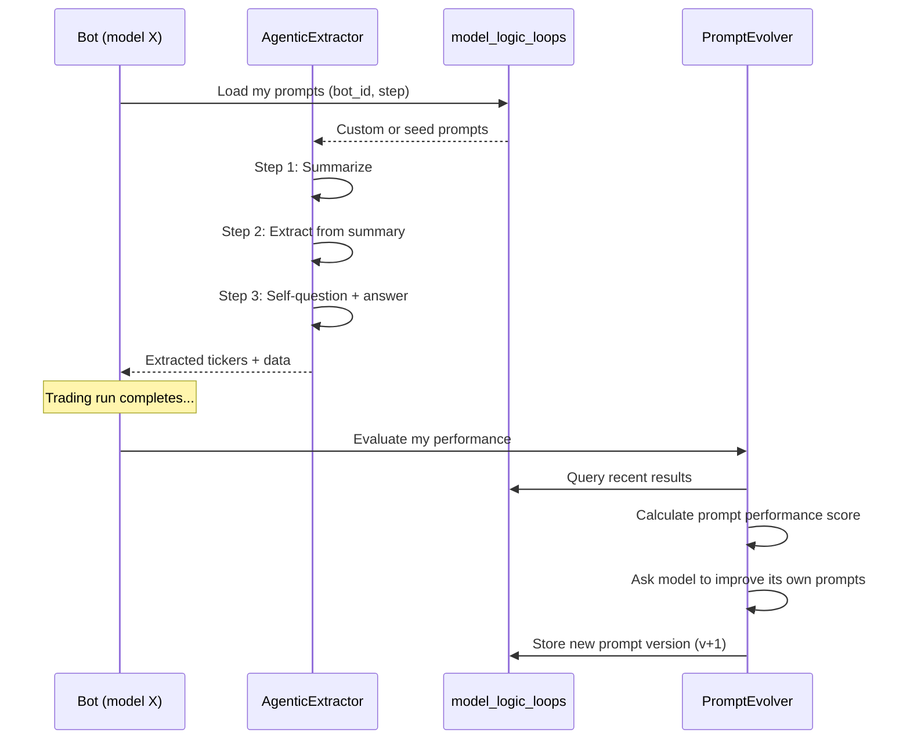

# Self-Improving Agentic Pipeline

## Problem

The current extraction prompt (`_EXTRACTION_PROMPT`) is a 75-line monolithic wall of text that:
- Forces a rigid JSON schema on every transcript regardless of content
- Fails on non-US content (Indian market videos, forex, crypto) — returns empty
- Is identical for all models — a 3B model gets the same prompt as a 35B model
- Never learns from failures — same prompt, same mistakes, every run

## Core Concept: Per-Model Logic Loops

Each LLM model gets its own **isolated set of evolving system prompts**. When a model is first registered (or re-added after deletion), it starts with default seed prompts. After each trading run, the model **evaluates its own performance** and proposes mutations to its prompts. Over time, each model develops its own extraction/trading strategy.

> [!IMPORTANT]
> Models NEVER share logic loops. Each model's prompts evolve independently based on its own performance data.

## Proposed Changes

### Database — Per-Model Prompt Store

#### [NEW] [model_logic_loops table](file:///home/braindead/github/Lazy-Trading-Bot/app/database.py)

```sql
CREATE TABLE IF NOT EXISTS model_logic_loops (
    id INTEGER PRIMARY KEY,
    bot_id VARCHAR NOT NULL,         -- FK to bots.bot_id
    step_name VARCHAR NOT NULL,       -- extraction, analysis, trading, peer_discovery  
    system_prompt TEXT NOT NULL,       -- the actual prompt text
    version INTEGER DEFAULT 1,        -- auto-increment per step
    performance_score FLOAT DEFAULT 0,-- how well this prompt performed
    created_at TIMESTAMP DEFAULT CURRENT_TIMESTAMP,
    is_active BOOLEAN DEFAULT TRUE,   -- only one active per bot+step
    parent_version INTEGER,           -- which version this mutated from
    mutation_reason TEXT               -- why the model changed it
);
```

**Key constraint**: Only ONE active prompt per `(bot_id, step_name)` pair.

---

### Agentic Extraction — Multi-Step Pipeline

#### [NEW] [AgenticExtractor.py](file:///home/braindead/github/Lazy-Trading-Bot/app/services/AgenticExtractor.py)

Replace the monolithic extraction with a 3-step agentic flow:

**Step 1 — Summarize** (short prompt, ~50 tokens):
```
Summarize this transcript in 3-5 sentences. Focus on: what stocks/assets discussed, key price levels, and the creator's sentiment.
```

**Step 2 — Extract** (uses summary from Step 1, ~80 tokens):
```
From this summary, extract US stock tickers (NYSE/NASDAQ only). Return JSON: {"tickers": [...], "trading_data": {...}}
```

**Step 3 — Self-Question** (agentic — LLM generates its OWN follow-ups):
```
Based on what you extracted, generate 1-3 follow-up questions that would help make better trading decisions. Then answer them.
```

Each step uses the **model's own stored prompt** from `model_logic_loops`. If no custom prompt exists (first run), use the seed defaults.

---

### Self-Improvement Loop

#### [NEW] [PromptEvolver.py](file:///home/braindead/github/Lazy-Trading-Bot/app/services/PromptEvolver.py)

Runs at the **end of each trading run** (after `autonomous_loop.run_full_loop()` completes):

1. **Evaluate**: Query the bot's recent results:
   - How many tickers were extracted? Were they valid?
   - Did trades based on extracted data profit or lose?
   - Were there transcripts that returned empty (like the Indian video)?
   
2. **Score**: Calculate a performance score for the current prompt version

3. **Mutate**: Ask the model to review its own prompts and suggest improvements:
   ```
   Your current extraction prompt produced these results: [stats].
   X transcripts returned zero tickers. Y trades lost money.
   Review your prompt and suggest specific improvements. Return the full improved prompt.
   ```

4. **Store**: Save the new prompt version with `parent_version` link

5. **Activate**: Set the new version as active (deactivate old ones)

---

### Logic Loop Lifecycle

#### [MODIFY] [bot_registry.py](file:///home/braindead/github/Lazy-Trading-Bot/app/services/bot_registry.py)

- On `register_bot()`: Seed default prompts into `model_logic_loops` for all steps
- On `delete_bot(hard=True)`: Delete the model's logic loop entries
- On `delete_bot(hard=False)` then re-register: Creates a FRESH logic loop (never inherits)

#### [MODIFY] [autonomous_loop.py](file:///home/braindead/github/Lazy-Trading-Bot/app/services/autonomous_loop.py)

- After `run_full_loop()` completes, call `PromptEvolver.evolve(bot_id)` to run the self-improvement cycle
- Pass `bot_id` through the extraction pipeline so prompts are loaded per-model

#### [MODIFY] [ticker_scanner.py](file:///home/braindead/github/Lazy-Trading-Bot/app/services/ticker_scanner.py)

- Replace the hardcoded `_EXTRACTION_PROMPT` with a call to `AgenticExtractor`
- `AgenticExtractor` loads the model's own prompts from `model_logic_loops`
- Falls back to seed defaults if no custom prompts exist

---

### Integration Flow



## Verification Plan

### Automated Tests
- Seed a bot, verify `model_logic_loops` has default entries
- Run extraction with the Indian market transcript — verify it handles gracefully (empty tickers, but meaningful summary)
- Run a full loop, verify `PromptEvolver` creates v2 prompts
- Delete and re-add a bot, verify fresh logic loop (v1 again)

### Manual Verification
- Run 2+ bots through "Run All" — verify each develops different prompts over multiple runs
- Check `model_logic_loops` table to see prompt evolution history
