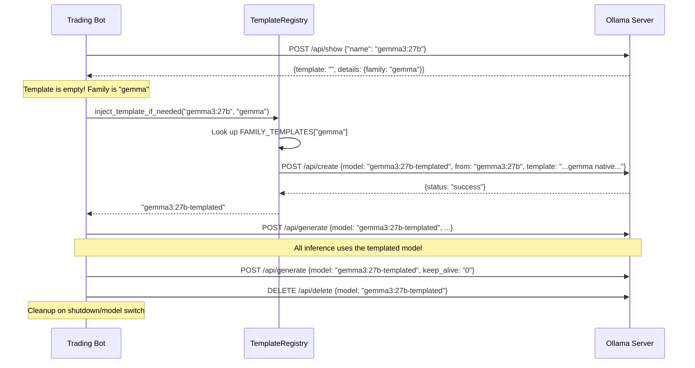

# Ollama Ephemeral Template Injection System

When you pull an Ollama model, it should include a chat template (the Go template string that wraps `{{ .System }}`, `{{ .Prompt }}`, `{{ .Response }}` into the correct token format for that model family). **Sometimes this template is missing or broken** — the model still "works" but silently degrades 10-15% in quality because tokens aren't formatted the way the model was trained to expect.

This plan introduces a system that:
1. **Detects** when a model's template is missing/empty via `/api/show`
2. **Creates an ephemeral wrapper model** with the correct template injected via `/api/create`
3. **Uses that wrapper** for inference
4. **Cleans up** the wrapper after the run via `/api/delete`

> [!IMPORTANT]
> The wrapper model is instant to create — it doesn't re-download or re-quantize anything. Ollama's `POST /api/create` with `from` simply creates a new manifest pointing at the same GGUF blobs with an overridden template layer. Creation takes < 1 second.

## User Review Required

> [!WARNING]
> **Risk: Custom templates making models worse.** This is your stated concern and it's valid. The mitigation is:
> - We **only inject templates for model families we have verified** (Llama, Gemma, Qwen, Phi, Mistral, etc.)
> - We use the model's **native training template**, not an arbitrary one
> - We **never override** an existing non-empty template (only fill in missing ones)
> - There will be a **UI toggle** to disable this entirely
> - A `/api/show`-based **dry-run mode** lets you preview what would be injected before committing

## Proposed Changes

### Template Registry

#### [NEW] [TemplateRegistry.py](file:///home/braindead/github/Lazy-Trading-Bot/app/services/TemplateRegistry.py)

A new service that manages:

1. **Family-to-template mapping** — Maps model architecture families to their correct native chat templates:
   ```python
   FAMILY_TEMPLATES = {
     "llama": "{{ if .System }}<|start_header_id|>system<|end_header_id|>\n\n{{ .System }}<|eot_id|>{{ end }}{{ if .Prompt }}<|start_header_id|>user<|end_header_id|>\n\n{{ .Prompt }}<|eot_id|>{{ end }}<|start_header_id|>assistant<|end_header_id|>\n\n{{ .Response }}<|eot_id|>",
     "gemma": "...",  # Gemma native template
     "qwen2": "...",  # Qwen2/QwQ native template
     "phi3": "...",   # Phi-3 native template
     "mistral": "...", # Mistral native template
     "chatml": "...",  # Generic ChatML fallback
   }
   ```

2. **Template detection** — Queries `POST /api/show` and checks:
   - Is the `template` field empty/missing?
   - Does the model's `details.family` match a known family?
   - If both: we have a template to inject

3. **Ephemeral model lifecycle**:
   - `create_templated_model(base_model, template)` → creates `{base_model}-templated` via `/api/create`
   - `delete_templated_model(model_name)` → removes it via `DELETE /api/delete`
   - `get_effective_model(base_model)` → returns the templated name if one was created, otherwise the original

---

### Warm-Up Integration

#### [MODIFY] [llm_service.py](file:///home/braindead/github/Lazy-Trading-Bot/app/services/llm_service.py)

The existing `verify_and_warm_ollama_model()` method already does:
1. Verify model exists (`/api/tags`)
2. Query architecture (`/api/show`)
3. Load model (`/api/generate`)

We insert a new step **2.5** between architecture query and model load:

```diff
 # Step 2: Query architecture
 show_resp = await client.post(f"{base_url}/api/show", json={"name": model})
 show_data = show_resp.json()
 model_info = show_data.get("model_info", {})
+
+# Step 2.5: Template injection (if needed)
+template_str = show_data.get("template", "")
+family = show_data.get("details", {}).get("family", "")
+if not template_str.strip() and settings.TEMPLATE_INJECTION_ENABLED:
+    from app.services.TemplateRegistry import TemplateRegistry
+    registry = TemplateRegistry(base_url)
+    injected = await registry.inject_template_if_needed(model, family)
+    if injected:
+        model = injected  # Use the templated model name
+        logger.info("[LLM] ✅ Template injected: using %s", model)

 # Step 3: Load model
 warm_resp = await client.post(f"{base_url}/api/generate", ...)
```

We also add cleanup in `unload_ollama_model()` to delete any ephemeral model when unloading:

```diff
 async def unload_ollama_model(base_url, model):
+    # Clean up ephemeral templated model if it exists
+    if model.endswith("-templated"):
+        await TemplateRegistry.delete_templated_model(base_url, model)
     # ... existing unload logic
```

---

### Config & Settings

#### [MODIFY] [config.py](file:///home/braindead/github/Lazy-Trading-Bot/app/config.py)

Add new settings:
```python
# Template injection (ephemeral wrapper models)
TEMPLATE_INJECTION_ENABLED: bool = True
TEMPLATE_INJECTION_MODE: str = "missing_only"  # "missing_only" | "always" | "never"
```

These will also be persisted/hot-patchable via `llm_config.json` alongside existing LLM settings.

---

### LLM Service Model Reference

#### [MODIFY] [llm_service.py](file:///home/braindead/github/Lazy-Trading-Bot/app/services/llm_service.py)

The `model` property and chat path need to be aware that the effective model name may differ from `settings.LLM_MODEL`. When a templated model is active:
- `self.model` returns the templated model name
- The warm-up result stores the mapping
- Prism receives the templated model name (Prism proxies to Ollama using whatever model name we give it)

---

## How It Works (End-to-End)



## Risk Mitigation

| Risk | Mitigation |
|------|------------|
| **Custom template makes model worse** | Only use the model's native training template, never an arbitrary one. `missing_only` mode = never override an existing template. |
| **Wrong family detection** | Validate `details.family` from `/api/show` against our known registry. If unknown → skip injection entirely. |
| **Ephemeral model not cleaned up** | Add cleanup to: model switch, shutdown, and startup (scan for `*-templated` models and delete). |
| **Ollama API version incompatibility** | The `POST /api/create` with `from` + `template` was added in Ollama 0.1.x and is stable. We wrap in try/except. |
| **Template breaks JSON constraint mode** | Template only affects chat formatting, not response format. JSON constraints go through `format` field or system prompt, which is orthogonal. |

## Verification Plan

### Automated Tests

#### [NEW] `tests/test_template_registry.py`

Unit tests for `TemplateRegistry`:
```
cd /home/braindead/github/Lazy-Trading-Bot && source venv/bin/activate && python -m pytest tests/test_template_registry.py -v
```
- Test family lookup (known family → template, unknown family → None)
- Test ephemeral model name generation
- Test create/delete lifecycle (mocked HTTP)
- Test `missing_only` mode skips when template exists
- Test `never` mode skips entirely

### Manual Verification

1. **Start the trading bot** and navigate to the Settings page
2. **Enable template injection** if not already on
3. **Switch to a model** known to be missing a template (or pull a fresh one)
4. **Check the logs** for `[LLM] ✅ Template injected: using <model>-templated`
5. **Run a pipeline cycle** and verify output quality is not degraded
6. **Switch models or stop the bot** and verify the `-templated` model is cleaned up (check `ollama list`)
