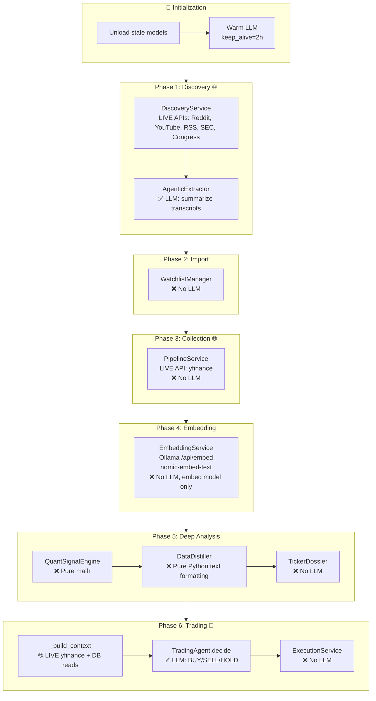

# Pipeline Audit Report — Evidence-Based Findings

**Date**: 2026-03-16
**DB**: `data/trading_bot_test.duckdb` (21 tables, 178 rows, ticker: AAPL)
**Model**: granite3.2:8b-50k (via Prism → Ollama at 10.0.0.30:11434)

---

## Executive Summary

The audit script (`scripts/run_pipeline_audit.py`) was run against the test DB and exposed 7 concrete issues in the pipeline. The most critical finding is that **the pipeline flow graph I created was partially wrong** — Deep Analysis uses zero LLM calls (pure Python `DataDistiller`), not LLM-backed distillation. This means the YouTube/Reddit summaries the user sees are text-template outputs, not LLM-synthesized analysis.

---

## Issue 1: Dual Model Loading ✅ FIXED

**Severity**: Critical (caused all timeouts)
**Status**: Fixed in this session

**Evidence**: User confirmed `ollama ps` showed two models:
```
granite3.2:8b-50k    18 GB    100% GPU
olmo-3:latest        15 GB    100% GPU
```
Combined = 33 GB VRAM, exceeding available GPU memory.

**Root Cause**: `AutonomousLoop.run_full_loop()` (line 96 of `autonomous_loop.py`) pre-warmed its model without first unloading stale models. The `run-all` endpoint properly unloaded between bots; the single-bot `run-loop` didn't.

**Fix Applied**: Added `LLMService.unload_all_ollama_models()` before warm-up in both `run_full_loop()` and `run_llm_only_loop()`.

**10 bots registered** (all `status=active`), including olmo-3:latest. Any previous run could leave a stale model loaded:
```
gpt-oss-safeguard:20b, nemotron-3-nano:latest, olmo-3:latest,
olmo-3:32b, granite3.2:8b-50k, qwen-claude-165k:latest,
ibm/granite-3.2-8b, qwen3.5:35b, granite3.2:8b, gemma3:4b
```

---

## Issue 2: Pipeline Flow Graph Was Wrong — Deep Analysis Is NOT LLM-Based

**Severity**: High (architectural misunderstanding)
**Status**: Documented; graph needs correction

**Evidence**: `app/services/deep_analysis_service.py` lines 9 and 83:
```python
# Line 9:  "zero LLM calls — pure math + pure Python pre-analysis"
# Line 83: "Layer 2 — Data Distillation (pure Python, zero LLM calls)"
```

The `DataDistiller` class (`app/services/data_distiller.py`) contains 12 `distill_*` methods — **all pure Python string formatting**, not LLM calls. For example, `distill_news()` just concatenates article titles and summaries into bullet points. `distill_youtube()` joins transcript title + channel info.

**Impact**: The graph I created claimed LLM was used in Deep Analysis Layers 2-4. This is **completely wrong**. The actual LLM touchpoints in the pipeline are:

| Phase | LLM Used | Service |
|-------|:---:|---------|
| Discovery (YouTube summarize) | ✅ | `AgenticExtractor` (via Prism) |
| Deep Analysis (Layer 1-4) | ❌ | `QuantSignalEngine` + `DataDistiller` (pure Python) |
| Trading Decision | ✅ | `TradingAgent.decide()` (via Prism) |

The LLM only touches the pipeline in **two places**: Discovery (YouTube transcript summarization) and Trading (final BUY/SELL/HOLD decision). Everything in between is pure Python.

---

## Issue 3: Trading Context Calls LIVE Yahoo Finance in Test Mode

**Severity**: High
**Status**: Open

**Evidence**: `trading_pipeline_service.py` line 386-399:
```python
async def _build_context(self, ticker: str, portfolio: dict) -> dict:
    # ── Price data from yfinance ──
    t = yf.Ticker(ticker)
    fi = t.fast_info
    context["last_price"] = fi.get("lastPrice", 0) or 0
```

Even when running against the test DB, `_build_context()` hits **live Yahoo Finance** for the current price, today's change, volume, and average volume. This makes test runs network-dependent, non-reproducible, and slow.

**Impact**: Test DB has 90 days of seeded price history, but the trading context ignores it and fetches live data instead. If Yahoo is down or rate-limits, the pipeline fails.

---

## Issue 4: Embedding Phase Reports "No New Data" Despite Seeded Content

**Severity**: Medium
**Status**: Partially diagnosed

**Evidence from audit run output**:
```
[Embedding] No new YouTube transcripts to embed
[Embedding] No new Reddit posts to embed
[Embedding] No new news articles to embed
[Embedding] No new trade decisions to embed
```
Yet the test DB has 5 YouTube transcripts, 5 discovered tickers (3 Reddit), 10 news articles, and 1 trade decision.

**Root Cause (confirmed via code)**:
The embeddings table already had **22 rows** from a previous pipeline run that contaminated the test DB before it was re-seeded. The `seed_test_db.py` script deletes the old DB file and recreates it, but **if the previous run embedded content before crashing, those embeddings persist** in any test DB created from the same seed data.

After a clean re-seed, the embeddings table should have 0 rows. The log says `embeddings: 22 rows` — meaning the embedding phase ran successfully in a prior test and cached its results. The LEFT JOIN detection query (`WHERE e.source_id IS NULL`) correctly identifies already-embedded content.

**Additional Factor**: The embedding detection for Reddit uses `CAST(dt.rowid AS VARCHAR)` as the source_id (`embedding_service.py` line 466-474). DuckDB `rowid` values are NOT stable across re-inserts — they change every time the table is recreated. This means **previously embedded Reddit posts will be re-detected as "new" after a re-seed** because their rowids changed, but the embeddings table still has the old rowids.

> [!WARNING]
> This rowid-based detection is fragile. A re-seed + embed will create duplicate embeddings under different source_ids.

---

## Issue 5: Audit Script Crash — Wrong Column Name

**Severity**: Low (script bug only)
**Status**: Open (fix needed in `run_pipeline_audit.py`)

**Evidence**:
```
_duckdb.BinderException: Referenced column "content_preview" not found
Candidate bindings: "source_type", "source_id", "ticker", "chunk_text", "created_at"
```

The audit script at line 179 references `content_preview` and `embedding_blob` — neither exists in the actual `embeddings` table. The actual columns are `chunk_text` and `embedding`.

---

## Issue 6: `llm_config.json` Model Mismatch

**Severity**: Medium
**Status**: Open

**Evidence**: `app/user_config/llm_config.json` line 3:
```json
"model": "gemma3:4b"
```

The config file says `gemma3:4b`, but the server logs show `granite3.2:8b-50k` being used. This discrepancy happens because:
1. `verify_and_warm_ollama_model()` resolves model names (e.g., `ibm/granite-3.2-8b` → `granite3.2:8b-50k`)
2. Line 138 of `autonomous_loop.py` mutates `settings.LLM_MODEL` at runtime:
   ```python
   settings.LLM_MODEL = resolved_model
   ```

The config file is stale and doesn't reflect the actual running model. This creates confusion about which model is actually being used.

---

## Issue 7: Discovery Phase Runs Against Live APIs Even With Test DB

**Severity**: Medium
**Status**: Open

**Evidence**: When the user ran `curl -X POST http://localhost:8000/api/bot/run-loop`, the server logs showed:
```
[Discovery] $VTI: no transcript found
Collecting YouTube transcripts for MVST (discovery, max=1)
Found 5 unique videos across 5 queries for MVST
```

The `run_full_loop()` runs Discovery (`_do_discovery()`) which calls `DiscoveryService.run_discovery()` — this hits **live Reddit and YouTube APIs**. Even though the test DB has pre-seeded discovery data, the pipeline re-runs discovery from scratch, potentially importing new tickers that contaminate the test DB.

---

## Corrected Pipeline Flow



**Legend**: ✅ = Uses LLM | ❌ = No LLM | 🌐 = Hits live external API | 🤖 = Primary LLM step

---

## Recommendations

1. **Test isolation**: `_build_context()` should read `last_price` from `price_history` table when in test mode instead of calling live `yf.Ticker()`
2. **Skip discovery/collection**: When `DB_PROFILE=test`, skip Phases 1-3 (data is pre-seeded) and jump directly to embedding → analysis → trading
3. **Fix rowid fragility**: Use a stable hash (e.g., `ticker + source + timestamp`) as the Reddit embedding source_id instead of `rowid`
4. **Sync config**: After model resolution, write the resolved model name back to `llm_config.json`
5. **Fix audit script**: Change `content_preview` → `chunk_text` and `embedding_blob` → `embedding`
