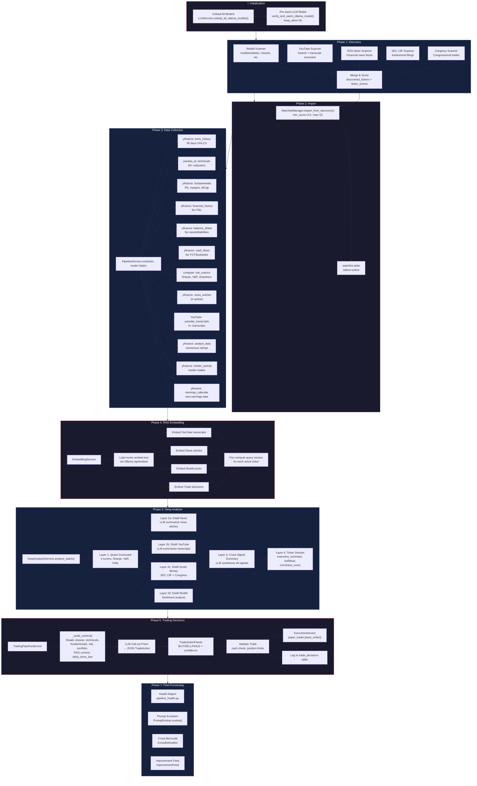

# Trading Bot Pipeline Flow Graph

## Full Pipeline: `AutonomousLoop.run_full_loop()`

## Data Flow Per Phase

| Phase | Input Tables | Output Tables | LLM Required |
|-------|-------------|---------------|:---:|
| Discovery | — (external APIs) | `discovered_tickers`, `ticker_scores`, `youtube_transcripts` | ✅ (AgenticExtractor) |
| Import | `ticker_scores` | `watchlist` | ❌ |
| Collection | `watchlist` | `price_history`, `technicals`, `fundamentals`, `financial_history`, `balance_sheet`, `cash_flows`, `risk_metrics`, `news_articles`, `analyst_data`, `insider_activity`, `earnings_calendar` | ❌ |
| Embedding | all content tables | `embeddings` (vector store) | ❌ (embed model only) |
| Deep Analysis | all data tables | `quant_scorecards`, `ticker_dossiers` | ✅ (distillation + synthesis) |
| Trading | `ticker_dossiers`, `technicals`, `fundamentals`, `risk_metrics`, `embeddings`, `trade_decisions` | `trade_decisions`, `orders`, `positions` | ✅ (trade decision) |

## Known Issues

1. **Dual Model Loading** — ✅ Fixed: `unload_all_ollama_models()` before warm-up
2. **LLM stops at summaries** — Deep Analysis Layer 2 (distillation) may not feed into Layer 3/4 properly
3. **Discovery runs during test** — Need to skip discovery/collection when using test DB (data pre-seeded)
