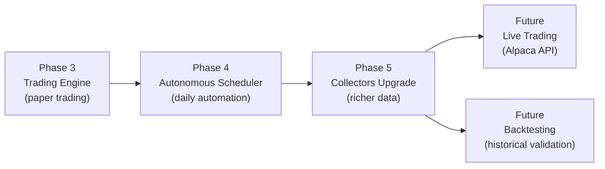

# Lazy Trading Bot — Plans Index

## Current Project State

The bot currently runs the **full autonomous pipeline** with one click:

```
Run Full Loop (button)
  → Discovery (Reddit + YouTube ticker scanning)
  → Auto-Import (top tickers → watchlist)
  → Deep Analysis (4-layer funnel: Quant → LLM Questions → RAG Answers → Dossier)
  → Trading (placeholder — Phase 3)
```

**Built and working**: Discovery, Watchlist, Deep Analysis, Autonomous Loop, Autobot Monitor UI

---

## Build Roadmap

| Phase | Plan | Status | What It Does |
|-------|------|--------|--------------|
| 1 | [Ticker Discovery](01_ticker_discovery.md) | ✅ Done | Reddit + YouTube scanning, ticker validation, scoring |
| 2 | [Automated Watchlist](02_automated_watchlist.md) | ✅ Done | Import from discovery, aging, confidence tracking |
| 2.5 | Deep Analysis (4-Layer Funnel) | ✅ Done | Quant signals → LLM questions → RAG answers → conviction dossier |
| 2.6 | Autonomous Loop | ✅ Done | One-click full pipeline orchestration with live progress UI |
| **3** | [**Trading Engine**](03_trading_engine.md) | 📋 **Next** | Paper/live trading, positions, triggers, portfolio management |
| **4** | [**Autonomous Scheduler**](04_scheduler.md) | 📋 Planned | APScheduler daily loop: pre-market → market hours → EOD |
| **5** | [**Collectors & Agents Upgrade**](collectors_and_agents_upgrade.md) | 📋 Planned | Expand data collection depth and LLM agent prompts |

### Supporting Plans (Older, Partially Superseded)

| Plan | Status | Notes |
|------|--------|-------|
| [Data Hardening](phase_8_data_hardening.md) | ⚠️ Partially done | YouTube 24h filter done; yFinance verification pending |
| [Frontend Dashboard](phase_9_frontend_dashboard.md) | ⚠️ Superseded | React-based Onyx Terminal built instead of vanilla JS |
| [Scheduling & Backtesting](phase_10_scheduling_backtesting.md) | ⚠️ Merged | Scheduling → Phase 4; Backtesting → future enhancement |

---

## Recommended Build Order



**Phase 3 first** — without trade execution, the loop finds signals but can't act on them.
**Phase 4 second** — automate what's already working (loop + trading).
**Phase 5 is enhancement** — richer data makes the AI smarter but isn't blocking.

---

## Key Files

| Area | Path |
|------|------|
| Pipeline | `app/services/pipeline_service.py` |
| Deep Analysis | `app/services/deep_analysis_service.py` |
| Autonomous Loop | `app/services/autonomous_loop.py` |
| Discovery | `app/services/discovery_service.py` |
| Watchlist | `app/services/watchlist_manager.py` |
| Collectors | `app/collectors/` |
| Agents | `app/agents/` |
| Models | `app/models/` |
| Prompts | `app/prompts/` |
| Database | `app/database.py` |
| Config | `app/config.py` |
| Frontend | `app/static/terminal_app.js` |
