# 🤖 Lazy Trading Bot — How It Actually Works

> A plain-English walkthrough of every step the bot takes, from "I heard about a stock on Reddit" to "I just paper-traded 50 shares."

---

## The Big Picture

The bot runs as a **single autonomous loop** that chains 5 phases together. Think of it like a trading desk in a box:

```
Phase 1: DISCOVERY    → "What stocks are people talking about?"
Phase 2: IMPORT       → "Add the best ones to my watchlist"
Phase 3: COLLECTION   → "Download all the financial data"
Phase 4: ANALYSIS     → "Run the numbers + ask the AI for a thesis"
Phase 5: TRADING      → "Let the AI portfolio manager make trades"
```

Everything is orchestrated by [autonomous_loop.py](file:///d:/Github/Lazy-Trading-Bot/app/services/autonomous_loop.py), which is the single entry point that kicks off the whole pipeline. The frontend polls its `get_status()` method to show live progress.

---

## Phase 1: Discovery — "What's Trending?"

**Goal:** Scan Reddit and YouTube to find stock tickers people are buzzing about.

**Orchestrator:** [discovery_service.py](file:///d:/Github/Lazy-Trading-Bot/app/services/discovery_service.py)

### Step 1a: Reddit Scanning

**File:** [reddit_collector.py](file:///d:/Github/Lazy-Trading-Bot/app/collectors/reddit_collector.py)

1. **Scrape subreddits** — Hits Reddit's *public* JSON API (no authentication needed, uses random User-Agents to avoid blocks). Targets:
   - **Priority threads:** Stickied "Daily Discussion" posts in r/wallstreetbets and r/stocks
   - **Trending threads:** Rising/new posts in r/wallstreetbets and r/pennystocks

2. **LLM filter** — Sends thread titles to the LLM and asks: *"Which of these are actually discussing stock catalysts?"* This filters out memes and off-topic posts.

3. **Fetch full thread data** — For each approved thread, grabs the body text + top comments via the JSON API (preserving Reddit permalinks for the UI).

4. **Extract tickers** — Uses regex to find uppercase 2-5 character words (e.g., `AAPL`, `TSLA`), then filters them through an exclusion list to remove common false positives like `AI`, `TLDR`, `NOT`, `CEO`.

5. **Validate tickers** — Each candidate goes through the [ticker_validator.py](file:///d:/Github/Lazy-Trading-Bot/app/collectors/ticker_validator.py), which uses `yfinance` to confirm it's a real, tradeable symbol. As a final check, the LLM gets asked: *"Is this really a stock ticker or just a word?"*

6. **Score tickers** — Each ticker gets a score based on how many times it was mentioned, across how many threads, and in which subreddits.

### Step 1b: YouTube Scanning

**Files:** [youtube_collector.py](file:///d:/Github/Lazy-Trading-Bot/app/collectors/youtube_collector.py) + [ticker_scanner.py](file:///d:/Github/Lazy-Trading-Bot/app/collectors/ticker_scanner.py)

1. **Search YouTube** — Uses `yt-dlp` to search for general market news videos (e.g., "stock market news today", "stocks to buy now"). Filters to videos published in the last 24 hours.

2. **Download transcripts** — Two-tier extraction strategy:
   - **Tier 1:** `youtube-transcript-api` (fast, pure Python)
   - **Tier 2:** `yt-dlp --write-auto-subs` (fallback for restricted videos)
   - Full transcripts are stored — no truncation.

3. **LLM ticker extraction** — Instead of regex, the [ticker_scanner.py](file:///d:/Github/Lazy-Trading-Bot/app/collectors/ticker_scanner.py) sends each transcript to the LLM with the prompt: *"List all stock tickers mentioned in this transcript."* This catches tickers mentioned by name rather than ticker symbol (e.g., "Apple" → `AAPL`).

4. **Channel trust scoring** — Tickers from trusted channels (CNBC, Bloomberg, Yahoo Finance) get higher scores. A mention on Jim Cramer's show weighs more than a random YouTuber.

5. **Validate + Score** — Same yfinance validation as Reddit. Score combines channel trust × mention count.

### Step 1c: Merge & Persist

The discovery service **merges** Reddit + YouTube scores. Same ticker from both sources gets a combined score. Everything is saved to **DuckDB** tables: `discovered_tickers` and `ticker_scores`.

---

## Phase 2: Import — "Add to the Watchlist"

**File:** [watchlist_manager.py](file:///d:/Github/Lazy-Trading-Bot/app/services/watchlist_manager.py)

This is the simplest phase:

1. **Pull top scorers** — Loads discovered tickers where `discovery_score >= 3.0`
2. **Add to watchlist** — Inserts them into the `watchlist` DuckDB table with status `active`
3. **Skip duplicates** — If a ticker is already on the watchlist (active or removed), it's skipped
4. **Cap at 10** — Maximum 10 new tickers per loop to avoid overwhelming the system

The watchlist is the **bridge** between discovery and analysis — only active watchlist tickers proceed to the next phases.

---

## Phase 3: Collection — "Get All the Data"

**Orchestrator:** [pipeline_service.py](file:///d:/Github/Lazy-Trading-Bot/app/services/pipeline_service.py) (called in `data` mode)

For each active watchlist ticker, the pipeline runs up to **12 data collection steps** using [yfinance_collector.py](file:///d:/Github/Lazy-Trading-Bot/app/collectors/yfinance_collector.py), [news_collector.py](file:///d:/Github/Lazy-Trading-Bot/app/collectors/news_collector.py), and [youtube_collector.py](file:///d:/Github/Lazy-Trading-Bot/app/collectors/youtube_collector.py):

| # | Step | Source | What It Gets |
|---|------|--------|-------------|
| 1 | Price History | yfinance | 1 year of daily OHLCV candles |
| 2 | Fundamentals | yfinance | P/E, market cap, revenue, margins, etc. |
| 3 | Financial History | yfinance | Multi-year income statements |
| 4 | Technical Indicators | Computed | SMA, EMA, RSI, MACD, Bollinger Bands |
| 5 | Balance Sheet | yfinance | Assets, liabilities, equity, debt ratios |
| 6 | Cash Flow | yfinance | Free cash flow, operating cash flow, CapEx |
| 7 | Analyst Data | yfinance | Price targets, buy/hold/sell recommendations |
| 8 | Insider Activity | yfinance | Insider buys/sells, institutional ownership |
| 9 | Risk Metrics | Computed | VaR, CVaR, max drawdown, Sharpe/Sortino |
| 10 | Earnings Calendar | yfinance | Next earnings date, EPS history |
| 11 | News Articles | yfinance + Google News RSS + SEC EDGAR | Headline, summary, source, date |
| 12 | YouTube Transcripts | yt-dlp | Full text transcripts of stock analysis videos |

All data is **persisted to DuckDB** so it survives server restarts and accumulates over time. The pipeline has a `Ticker object cache` to reuse yfinance connections and a `retry decorator` with exponential backoff for rate limits.

---

## Phase 4: Deep Analysis — "The 4-Layer Funnel"

**Orchestrator:** [deep_analysis_service.py](file:///d:/Github/Lazy-Trading-Bot/app/services/deep_analysis_service.py)

This is where the bot gets (genuinely) smart. For each ticker, it runs 4 layers of analysis with bounded concurrency (2 tickers in parallel to avoid LLM overload):

```mermaid
flowchart TD
    A["Layer 1: Quant Signal Engine<br/><i>Pure math, zero LLM calls</i>"] --> B["Layer 2: Question Generator<br/><i>1 LLM call</i>"]
    B --> C["Layer 3: RAG Answer Engine<br/><i>5 LLM calls</i>"]
    C --> D["Layer 4: Dossier Synthesizer<br/><i>1 LLM call</i>"]
    D --> E["TickerDossier<br/><i>conviction score 0.0 → 1.0</i>"]
```



### Layer 1: Quant Signal Engine (Pure Math)

**File:** [quant_signals.py](file:///d:/Github/Lazy-Trading-Bot/app/engine/quant_signals.py)

**Zero LLM calls.** Reads Phase 3 data from DuckDB and crunches numbers:

**Signal Generation:**

- Z-Score (20-day, MAD-robust) — how far is current price from the mean?
- Bollinger %B — position within Bollinger Bands
- Percentile rank — where does current price/volume sit historically?

**Risk/Reward Ratios:**

- Sharpe, Sortino, Calmar — risk-adjusted return quality
- Omega ratio — probability-weighted gains vs losses (captures skew/kurtosis)
- Kelly fraction — mathematically optimal bet size (uses half-Kelly for safety)
- VaR/CVaR (95%) — worst-case daily loss estimates
- Max drawdown — largest peak-to-trough decline

**PhD-Level Quant Signals:**

- **Momentum factor** — 12-month return using the Jegadeesh & Titman (1993) methodology with skip-month convention
- **Mean reversion score** — distance from SMA-50 in standard deviations
- **Hurst exponent** — R/S analysis to determine if the stock is trending (>0.5) or mean-reverting (<0.5)
- **VWAP deviation** — institutional buying/selling pressure signal
- **Earnings yield gap** — equity risk premium vs 10Y Treasury (Fed Model)
- **Altman Z-Score** — bankruptcy risk predictor
- **Piotroski F-Score** — 9-point financial health checklist

**Anomaly Flags:** Auto-detects unusual conditions that need investigation:

- Extreme Z-scores (|Z| > 2.0)
- Bollinger squeeze or breakout
- Volume spike (>90th percentile)
- High drawdown (>20%)
- Near-earnings events

**Output:** A `QuantScorecard` Pydantic model with ~25 numeric fields + anomaly flags.

### Layer 2: Question Generator (1 LLM Call)

**File:** [question_generator.py](file:///d:/Github/Lazy-Trading-Bot/app/engine/question_generator.py)

The LLM receives the `QuantScorecard` and is prompted as a *"senior quant analyst."* It generates **exactly 5 follow-up questions** that would help determine BUY/HOLD/SELL.

Each question targets a specific data source:

- `news` — News articles
- `transcripts` — YouTube transcripts
- `fundamentals` — Company financials
- `technicals` — Technical indicators
- `insider` — Insider trading data

**Example:** If the scorecard shows a massive volume spike + extreme Z-score, the LLM might ask: *"What news event caused NVDA's 300% volume spike on Feb 14?"*

**Fallback:** If the LLM fails, hardcoded fallback questions are generated based on the anomaly flags.

### Layer 3: RAG Answer Engine (5 LLM Calls)

**File:** [rag_engine.py](file:///d:/Github/Lazy-Trading-Bot/app/engine/rag_engine.py)

For each of the 5 questions from Layer 2:

1. **Source routing** — Maps `target_source` to the right DuckDB query:
   - `news` → fetches article titles/summaries
   - `transcripts` → fetches YouTube transcript text
   - `fundamentals` → serializes financial tables as readable text
   - `technicals` → fetches recent indicator values
   - `insider` → fetches insider transaction data

2. **Chunking** — Splits retrieved text into overlapping 1500-char chunks (200-char overlap)

3. **BM25 keyword ranking** — Scores each chunk against the question using a simple whitespace tokenizer + TF-IDF-like scoring. Selects the top 3 most relevant chunks.

4. **LLM answer extraction** — Sends the top chunks + question to the LLM: *"Answer this question using ONLY the provided data. If the data doesn't answer, say so."*

**Output:** 5 `QAPair` objects, each with `question`, `answer`, `source`, and `confidence`.

### Layer 4: Dossier Synthesizer (1 LLM Call)

**File:** [dossier_synthesizer.py](file:///d:/Github/Lazy-Trading-Bot/app/engine/dossier_synthesizer.py)

Takes the `QuantScorecard` (Layer 1) + 5 `QAPairs` (Layer 3) + current portfolio context, and makes one final LLM call to produce a `TickerDossier`:

```
{
  "executive_summary": "3-5 sentences covering the thesis",
  "bull_case": "Strongest arguments for buying",
  "bear_case": "Strongest arguments against buying",
  "key_catalysts": ["catalyst 1", "catalyst 2", "catalyst 3"],
  "conviction_score": 0.72,
  "signal_summary": "One-line quant interpretation"
}
```

**Conviction Score Rules:**

| Range | Meaning |
|-------|---------|
| 0.00 – 0.25 | **Strong SELL** — serious red flags |
| 0.25 – 0.40 | **Lean SELL** — more negatives than positives |
| 0.40 – 0.60 | **RARE** — only for genuinely 50/50 cases |
| 0.60 – 0.75 | **Lean BUY** — positive thesis with risks |
| 0.75 – 1.00 | **Strong BUY** — compelling opportunity |

**Context-window guardrail:** Estimates total token count and, if too large, trims Q&A pairs by dropping the lowest-confidence ones first.

The dossier is stored in DuckDB and the watchlist entry is updated with the conviction score.

---

## Phase 5: Trading — "The AI Portfolio Manager"

**Goal:** An LLM agent with tool-calling autonomy reviews ALL dossiers, sees the full portfolio, and decides what to trade.

### Step 5a: Price Trigger Check

**File:** [price_monitor.py](file:///d:/Github/Lazy-Trading-Bot/app/services/price_monitor.py)

Before the strategist runs, the bot checks all active price triggers:

- **Stop-loss** — If current price ≤ trigger price → auto-sell
- **Take-profit** — If current price ≥ trigger price → auto-sell
- **Trailing stop** — Tracks the high-water mark; if price drops below `HWM × (1 - trailing%)` → auto-sell. The trigger price ratchets UP as the stock rises.

Prices are fetched live from yfinance `fast_info`.

### Step 5b: Portfolio Strategist (LLM Tool-Calling Agent)

**File:** [portfolio_strategist.py](file:///d:/Github/Lazy-Trading-Bot/app/engine/portfolio_strategist.py)

This is the brain of the trading phase. Instead of per-ticker threshold logic, a single LLM call gets:

- **System prompt** with available tools
- **All ticker dossiers** (executive summary, conviction, bull/bear case)
- **Full portfolio state** (cash, positions, P&L)

The LLM operates in a **multi-turn tool-calling loop** (max 10 turns):

```
Turn 1: LLM calls get_portfolio → sees $10,000 cash, 2 positions
Turn 2: LLM calls get_all_candidates → sees 5 dossiers with convictions
Turn 3: LLM calls place_buy(NVDA, 10, "Strong AI catalyst") → order filled
Turn 4: LLM calls set_triggers(NVDA, stop=5%, take_profit=15%) → triggers set
Turn 5: LLM calls finish → loop ends
```

**Available Tools:**

| Tool | What It Does |
|------|-------------|
| `get_portfolio` | Returns cash, positions, total value, realized P&L |
| `get_all_candidates` | Returns conviction + summary for each analyzed ticker |
| `place_buy` | Buy shares (requires ticker, qty, reason) |
| `place_sell` | Sell shares (requires ticker, qty, reason) |
| `set_triggers` | Set stop-loss, take-profit, and trailing stop for a position |
| `get_market_status` | Returns current day/time (market hours awareness) |
| `finish` | End the trading session with a summary |

### Step 5c: Paper Trader (Simulated Execution)

**File:** [paper_trader.py](file:///d:/Github/Lazy-Trading-Bot/app/services/paper_trader.py)

All trades are **simulated** — no real money ever moves:

- **Buy** → Deducts cash, creates/updates a position row in DuckDB, records the order
- **Sell** → Adds cash back, reduces/closes the position, computes realized P&L
- **Portfolio snapshots** → Periodically records total portfolio value for the equity curve chart
- **Starting balance** is loaded from `user_config/risk_params.json`

---

## Supporting Components

### Data Distiller

**File:** [data_distiller.py](file:///d:/Github/Lazy-Trading-Bot/app/engine/data_distiller.py)

**Purpose:** Transforms raw numeric data into human-readable text so the LLM can reason about it. Instead of feeding the LLM 1,000 OHLCV rows, it pre-detects:

- **Trend regime** (uptrend/downtrend/sideways via SMA slopes)
- **Key crossovers** (golden cross, death cross, MACD crossover)
- **RSI divergences** (price making new highs but RSI declining)
- **Support/resistance zones** (clustered local min/max)
- **Volume patterns** (accumulation, distribution)
- **Valuation context** (P/E above/below sector average, revenue growth trends)

### Rules Engine

**File:** [rules_engine.py](file:///d:/Github/Lazy-Trading-Bot/app/engine/rules_engine.py)

Evaluates the user's trading strategy (`user_config/strategy.md`) against pooled agent reports. Key innovation: **deterministic pre-evaluation** of numeric rules in Python to prevent LLM hallucination on simple checks like "RSI > 70."

### Signal Router

**File:** [signal_router.py](file:///d:/Github/Lazy-Trading-Bot/app/engine/signal_router.py)

Converts dossier conviction scores into sized orders using risk parameters. Applies guardrails:

- Max position size (% of portfolio)
- Max portfolio allocation per ticker
- Max orders per day
- Daily loss limit
- Cooldown period after selling

### LLM Service

**File:** [llm_service.py](file:///d:/Github/Lazy-Trading-Bot/app/services/llm_service.py)

Provider-agnostic wrapper supporting **Ollama** and **LM Studio** (OpenAI-compatible). Features:

- Shared `httpx` async connection pool
- Automatic context-window overflow handling (trims longest message and retries)
- JSON response cleaning (strips markdown code fences)
- Health check endpoint

### Database

**File:** [database.py](file:///d:/Github/Lazy-Trading-Bot/app/database.py)

Everything persists in a single **DuckDB** file (`data/trading_bot.duckdb`). Key tables:

| Table | Purpose |
|-------|---------|
| `discovered_tickers` | Raw discovery results with scores |
| `ticker_scores` | Aggregated discovery scores |
| `watchlist` | Active tickers being tracked |
| `price_history` | OHLCV candles |
| `fundamentals` | Daily snapshots of company metrics |
| `financial_history` | Multi-year income statements |
| `balance_sheet` | Multi-year balance sheets |
| `cashflow` | Multi-year cash flow statements |
| `analyst_data` | Price targets + recommendations |
| `insider_activity` | Insider transactions |
| `earnings_calendar` | Upcoming earnings dates |
| `news_articles` | Collected news articles |
| `youtube_transcripts` | Stored video transcripts |
| `quant_scorecards` | Layer 1 numeric outputs |
| `dossiers` | Layer 4 synthesized analysis |
| `paper_positions` | Open simulated positions |
| `paper_orders` | Order history |
| `portfolio_snapshots` | Equity curve data points |
| `price_triggers` | Active stop-loss / take-profit triggers |

---

## How It All Fits Together


### Total LLM Calls Per Ticker (Analysis Phase)

| Layer | Calls | Purpose |
|-------|-------|---------|
| Layer 1 | 0 | Pure math |
| Layer 2 | 1 | Generate 5 questions |
| Layer 3 | 5 | Answer 5 questions |
| Layer 4 | 1 | Synthesize dossier |
| **Total** | **7** | Per ticker |

Plus: 1 strategist call (shared across all tickers) + discovery calls (LLM filtering, ticker extraction).

---

## Configuration

| File | Purpose |
|------|---------|
| [config.py](file:///d:/Github/Lazy-Trading-Bot/app/config.py) | Server settings, LLM provider URLs, paths |
| `user_config/llm_config.json` | Persisted LLM settings (provider, model, context size, temperature) |
| `user_config/risk_params.json` | Starting balance, max position size, daily limits |
| `user_config/strategy.md` | User's plain-English trading strategy for the Rules Engine |
| `.env` | Environment variables (overridden by UI settings) |

---

*This document explains the logic as of February 2026. No code was modified.*
