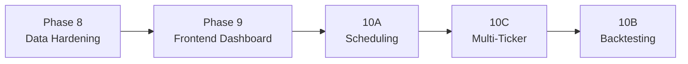

# Phase 10: Scheduling, Backtesting & Multi-Ticker

> Automation and validation features to make the bot production-useful.

## 10A — Scheduled Pipeline Runs

### Problem

Currently the pipeline only runs on-demand via API. A trading bot needs automated schedules.

### Design

- **APScheduler** integration (Python-native, works with asyncio)
- **Pre-market scan** (8:00 AM ET): Run `data` mode for all watchlist tickers to refresh data
- **Market-hours analysis** (9:30 AM ET): Run `full` mode for all tickers
- **Post-market summary** (4:30 PM ET): Generate daily summary report
- **Configurable intervals**: User can adjust schedule via API or config file

### Implementation

- New `app/services/scheduler.py` with APScheduler setup
- Cron-style job definitions reading from `watchlist.json`
- API endpoints to start/stop/view scheduled jobs
- Results logged to DB + saved to `data/reports/`

---

## 10B — Backtesting Engine

### Problem

No way to validate whether the bot's recommendations would have been profitable historically.

### Design

1. **Historical data**: Use stored price history from DuckDB
2. **Replay loop**: For each trading day in the backtest window:
   - Build the data context as it would have appeared on that date
   - Run agents with that context
   - Record the decision (BUY/SELL/HOLD)
   - Calculate hypothetical P&L based on next-day price movements
3. **Report**: Win rate, total return, Sharpe ratio, max drawdown

### Key Decisions

- **Simulated vs real agent calls**: Real calls are expensive (LLM inference). Option to cache agent responses for replay.
- **Lookback window**: Default 90 days
- **Position sizing**: Use the user's `risk_params.json`

### Implementation

- New `app/services/backtester.py`
- New Pydantic models for backtest results
- API endpoint `POST /backtest/{ticker}` with date range params
- Dashboard page for viewing backtest results with equity curve

---

## 10C — Multi-Ticker Parallel Execution

### Problem

Currently `pipeline_service.py` processes one ticker at a time. The watchlist might have 5-10 tickers.

### Design

- `asyncio.gather()` with semaphore to limit concurrency (e.g. max 3 concurrent)
- Prevents overloading the LLM backend
- New `POST /analyze/all` endpoint to run all watchlist tickers
- Progress tracking via WebSocket or polling endpoint

### Implementation

- Add `run_all()` method to `PipelineService`
- Semaphore-controlled parallel execution
- Progress events for frontend consumption

---

## Priority Order

**Recommended sequence**: 8 → 9 → 10A → 10C → 10B

- **Phase 8** is critical — without reliable data, nothing else works
- **Phase 9** gives visibility into what the bot is doing
- **10A** (scheduling) unlocks automation
- **10C** (multi-ticker) is a quick win after scheduling
- **10B** (backtesting) is most complex and benefits from having everything else working first
